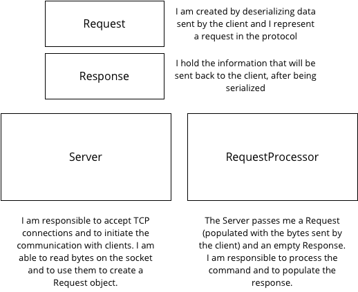
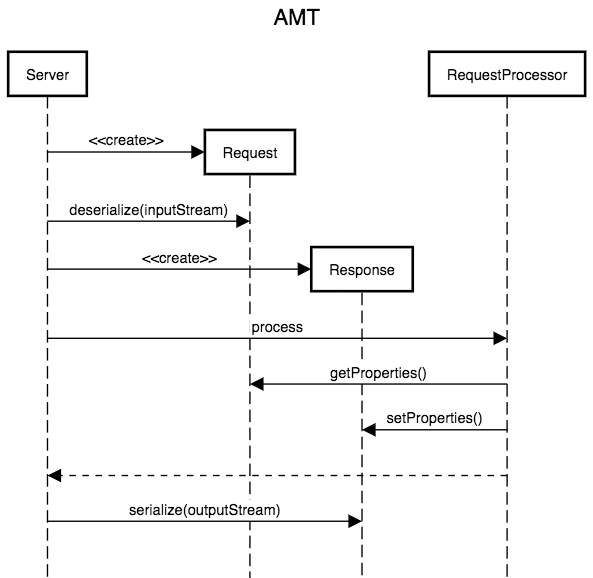

# Teaching-HEIGVD-AMT-Framework
## Introduction

This project was create to illustrate how an application server works "behind the scenes". We have tried to write as little code as possible to demonstrate a number of patterns and mechanisms. We have also done that in a step-by-step fashion, adding more features in every git branch.

While application servers work do most of their work with HTTP requests, we have made the choice to specify our own application-level protocol. This protocol allows clients to connect to the server over TCP, and to send a series of one-line commands (every command contains the name of a service, the name of a commands and a list of optional parameters).

## Specification of the AMT protocol

* The server accepts connection requests on TCP port 2205.

* Once the connection has been established, the client sends a command with the following syntax:

  ```
  request = serviceName ":" operationName *(":" parameterValue) CRLF
  ```

  In other words, a request specified the **name of a service** (e.g. clockService), the **name of an operation** provided by this service (e.g. getTime), and a list of **n parameters**. Each element in the command is separated by a semicolon. The command is terminated by the sequence CRLF.

  Note that service names, operation names and parameter values MUST NOT contain semicolons, nor the CRLF sequence.

* The server processes the command and sends back a response with the following syntax:

* ```
  response = statusCode ":" returnValue CRLF
  ```

  If the command has been processed successfully, `statusCode` is equal to 0 and returnValue is the value returned by the service operation. If the server was unable to process the command, `statusCode`has a non-zero value and `returnValue` contains an error message.

  Commands and responses are always encoded in UTF-8.

* When the client has read the server response, it can send a new command or close the TCP connection.

### Example scenario

```
S: accept connections on TCP port 2205
C: opens connection
C: healthCheckService:ping CRLF
S: 0:I am alive CRLF
C: healthCheckService:uptime CRLF
S: 0:12884
C: doesNotExistService:doSomething:v1:v2 CRLF
S: 4001:invalid service name
C: healthCheckService:doesNotExistOperation:v1 CRLF
S: 4002:invalid operation name
C: calculatorService:add:12:23
S: 0:35
C: calculatorService:add:12:string
S: 4003:invalid parameter (2)
C: calculatorService:add:12
S: 4004:missing parameter
```

## Design of the first implementation

Let's start with a minimal implementation that meets these requirements. We have decided to use 4 key classes: Server, RequestProcessor, Request and Response. The responsibilities of these classes are described in the class diagram:




The interactions between these classes are shown in the sequence diagram. When the Server has accepted a connection request, it starts reading lines from the socket. For each line, it creates a Request and an (empty) Response. It passes them to the RequestProcessor. The RequestProcessor reads data in the Request object and writes data in the Response object. When the RequestProcessor is done, the Server serializes the Response and writes the bytes on the socket, sending them to the client.



## Critique of this version (step-01-only-a-framework)

This version has a number of flaws:

* The code is **not easy to extend**. If we define new commands, we have to modify the RequestProcessor. This class will quickly become long and hard to maintain when we add new commands.
* We **do not have a clean separation** between the generic code (the classes that implement the core protocol) and the application-specific code (the commands that we add on top, such as the calculator service).

## Suggested refactoring

To improve the design, we could:

* Introduce the notions of **Service** and **ServiceRegistry**. This would allow us to implement the behavior of every new protocol command in a separate class.

* Split the codebase in two projects. The framework module would implement the generic behaviour, whereas the application module would implement the specific commands. The application module would have a dependency on the framework module.

* This would illustrate the notion of **Inversion of Control (IoC) pattern**. When this pattern is applied, the developer is not invoking methods or functions provided by a **library**. Instead, the developer provides code that is invoked by a **framework**, when a certain event occurs.

  ## 

